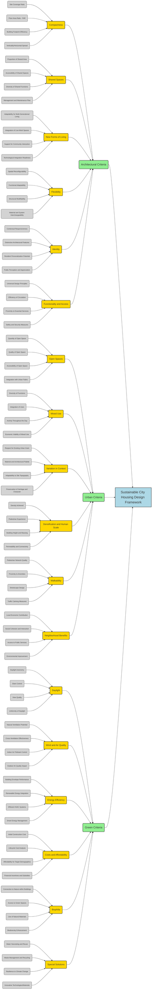

```mermaid
graph LR
    A[Sustainable City Housing Design Framework]

    B(Architectural Criteria) --> A
    C(Urban Criteria) --> A
    D(Green Criteria) --> A

    B1(Compactness) --> B
    B1_1(Site Coverage Ratio) --> B1
    B1_2(Floor Area Ratio - FAR) --> B1
    B1_3(Building Footprint Efficiency) --> B1
    B1_4(Verticality/Horizontal Spread) --> B1

    B2(Shared Spaces) --> B
    B2_1(Proportion of Shared Area) --> B2
    B2_2(Accessibility of Shared Spaces) --> B2
    B2_3(Diversity of Shared Functions) --> B2
    B2_4(Management and Maintenance Plan) --> B2

    B3(New Forms of Living) --> B
    B3_1(Adaptability for Multi-Generational Living) --> B3
    B3_2(Integration of Live-Work Spaces) --> B3
    B3_3(Support for Community Interaction) --> B3
    B3_4(Technological Integration Readiness) --> B3

    B4(Flexibility) --> B
    B4_1(Spatial Reconfigurability) --> B4
    B4_2(Functional Adaptability) --> B4
    B4_3(Structural Modifiability) --> B4
    B4_4(Material and System Interchangeability) --> B4

    B5(Identity) --> B
    B5_1(Contextual Responsiveness) --> B5
    B5_2(Distinctive Architectural Features) --> B5
    B5_3(Resident Personalization Potential) --> B5
    B5_4(Public Perception and Appreciation) --> B5

    B6(Functionality and Access) --> B
    B6_1(Universal Design Principles) --> B6
    B6_2(Efficiency of Circulation) --> B6
    B6_3(Proximity to Essential Services) --> B6
    B6_4(Safety and Security Measures) --> B6

    C1(Open Spaces) --> C
    C1_1(Quantity of Open Space) --> C1
    C1_2(Quality of Open Space) --> C1
    C1_3(Accessibility of Open Space) --> C1
    C1_4(Integration with Urban Fabric) --> C1

    C2(Mixed Use) --> C
    C2_1(Diversity of Functions) --> C2
    C2_2(Integration of Uses) --> C2
    C2_3(Activity Throughout the Day) --> C2
    C2_4(Economic Viability of Mixed Use) --> C2

    C3(Variation in Context) --> C
    C3_1(Respect for Existing Urban Grain) --> C3
    C3_2(Material and Architectural Palette) --> C3
    C3_3(Adaptability to Site Topography) --> C3
    C3_4(Preservation of Heritage and Character) --> C3

    C4(Densification and Human Scale) --> C
    C4_1(Density Achieved) --> C4
    C4_2(Pedestrian Experience) --> C4
    C4_3(Building Height and Massing) --> C4
    C4_4(Permeability and Connectivity) --> C4

    C5(Walkability) --> C
    C5_1(Pedestrian Network Quality) --> C5
    C5_2(Proximity to Amenities) --> C5
    C5_3(Streetscape Design) --> C5
    C5_4(Traffic Calming Measures) --> C5

    C6(Neighborhood Benefits) --> C
    C6_1(Local Economic Contribution) --> C6
    C6_2(Social Cohesion and Interaction) --> C6
    C6_3(Access to Public Services) --> C6
    C6_4(Environmental Improvement) --> C6

    D1(Daylight) --> D
    D1_1(Daylight Autonomy) --> D1
    D1_2(Glare Control) --> D1
    D1_3(View Quality) --> D1
    D1_4(Uniformity of Daylight) --> D1

    D2(Wind and Air Quality) --> D
    D2_1(Natural Ventilation Potential) --> D2
    D2_2(Cross-Ventilation Effectiveness) --> D2
    D2_3(Indoor Air Pollutant Control) --> D2
    D2_4(Outdoor Air Quality Impact) --> D2

    D3(Energy Efficiency) --> D
    D3_1(Building Envelope Performance) --> D3
    D3_2(Renewable Energy Integration) --> D3
    D3_3(Efficient HVAC Systems) --> D3
    D3_4(Smart Energy Management) --> D3

    D4(Costs and Affordability) --> D
    D4_1(Initial Construction Cost) --> D4
    D4_2(Lifecycle Cost Analysis) --> D4
    D4_3(Affordability for Target Demographics) --> D4
    D4_4(Financial Incentives and Subsidies) --> D4

    D5(Biophilia) --> D
    D5_1(Connection to Nature within Buildings) --> D5
    D5_2(Access to Green Spaces) --> D5
    D5_3(Use of Natural Materials) --> D5
    D5_4(Biodiversity Enhancement) --> D5

    D6(Special Solutions) --> D
    D6_1(Water Harvesting and Reuse) --> D6
    D6_2(Waste Management and Recycling) --> D6
    D6_3(Resilience to Climate Change) --> D6
    D6_4(Innovative Technologies/Materials) --> D6

    linkStyle default interpolate basis
    classDef default fill:#f9f,stroke:#333,stroke-width:2px;
    classDef mainNode fill:#ADD8E6,stroke:#333,stroke-width:2px,font-size:24px;
    classDef categoryNode fill:#90EE90,stroke:#333,stroke-width:2px,font-size:20px;
    classDef criteriaNode fill:#FFD700,stroke:#333,stroke-width:2px,font-size:16px;
    classDef subCriteriaNode fill:#D3D3D3,stroke:#333,stroke-width:1px,font-size:12px;

    class A mainNode;
    class B,C,D categoryNode;
    class B1,B2,B3,B4,B5,B6 criteriaNode;
    class C1,C2,C3,C4,C5,C6 criteriaNode;
    class D1,D2,D3,D4,D5,D6 criteriaNode;
    class B1_1,B1_2,B1_3,B1_4,B2_1,B2_2,B2_3,B2_4,B3_1,B3_2,B3_3,B3_4,B4_1,B4_2,B4_3,B4_4,B5_1,B5_2,B5_3,B5_4,B6_1,B6_2,B6_3,B6_4 subCriteriaNode;
    class C1_1,C1_2,C1_3,C1_4,C2_1,C2_2,C2_3,C2_4,C3_1,C3_2,C3_3,C3_4,C4_1,C4_2,C4_3,C4_4,C5_1,C5_2,C5_3,C5_4,C6_1,C6_2,C6_3,C6_4 subCriteriaNode;
    class D1_1,D1_2,D1_3,D1_4,D2_1,D2_2,D2_3,D2_4,D3_1,D3_2,D3_3,D3_4,D4_1,D4_2,D4_3,D4_4,D5_1,D5_2,D5_3,D5_4,D6_1,D6_2,D6_3,D6_4 subCriteriaNode;
```

